# Design Document

## Overview

SCOUT is designed as a multi-agent AI system that orchestrates specialized research agents to provide comprehensive market intelligence. The architecture follows a microservices pattern with a React frontend, FastAPI backend, and multiple AI agents powered by Strands SDK and AWS Bedrock.

## Architecture

### High-Level Architecture

```mermaid
graph TB
    subgraph "Frontend Layer"
        A[React TypeScript UI]
        B[Real-time Updates]
        C[PDF Report Viewer]
    end
    
    subgraph "API Gateway"
        D[FastAPI Backend]
        E[Streaming Endpoints]
        F[File Management]
    end
    
    subgraph "AI Agent Layer - Strands SDK"
        G[🎯 Planner Agent]
        H[🔍 Market Agent]
        I[🏢 Competition Agent]
        J[💰 Price Agent]
        K[⚖️ Legal Agent]
        L[📊 Synthesis Agent]
    end
    
    subgraph "External APIs"
        M[Tavily Search]
        N[Google Places]
        O[AWS Bedrock]
    end
    
    subgraph "Storage & Reports"
        P[Local Storage]
        Q[PDF Generator]
        R[Report Manager]
    end
    
    A --> D
    B --> E
    C --> F
    D --> G
    G --> H
    G --> I
    G --> J
    G --> K
    H --> L
    I --> L
    J --> L
    K --> L
    H --> M
    I --> N
    G --> O
    L --> Q
    Q --> R
    R --> P
```



### Agent Workflow


## Components and Interfaces

### Frontend Components

#### Main Application Component
- **Purpose**: Root component managing application state and routing
- **Responsibilities**: 
  - Mode selection (Chat vs Agent)
  - File upload handling
  - Report management
  - Global state management

#### Chat Interface Component
- **Purpose**: Handles real-time chat interactions with the Planner Agent
- **Responsibilities**:
  - Message input and display
  - Streaming response handling
  - Context management
  - Mode switching

#### Update Component
- **Purpose**: Displays real-time progress updates from specialist agents
- **Responsibilities**:
  - EventSource connection management
  - Progress visualization with timeline
  - Agent status tracking
  - Report link generation

#### Report Viewer Component
- **Purpose**: Manages report display and download functionality
- **Responsibilities**:
  - PDF generation and streaming
  - Report listing and organization
  - Download management

### Backend API Endpoints

#### Core Endpoints
- `POST /api/upload` - File upload and PDF text extraction
- `POST /api/chat/stream` - Streaming chat with Planner Agent
- `GET /api/specialist/stream` - Real-time agent progress updates
- `GET /api/reports/list` - List generated reports
- `GET /api/reports/{report_name}` - Download PDF reports
- `POST /api/context/clear` - Clear document context
- `GET /api/plan/todo` - Get current research plan

### Agent Architecture

#### Planner Agent
- **Purpose**: Central orchestrator and user interface
- **Tools**:
  - `update_todo_list`: Creates structured research plans
  - `execute_research_plan`: Coordinates specialist agents
  - `run_synthesis_agent_tool`: Triggers final report compilation
- **Modes**: Chat mode (conversational) and Agent mode (structured research)

#### Market Agent
- **Purpose**: Analyzes market size, trends, and opportunities
- **Tools**:
  - `get_market_data`: Fetches market intelligence via Tavily API
  - `update_work_progress`: Reports progress to monitoring system
  - `save_market_report`: Saves analysis to shared storage

#### Competition Agent
- **Purpose**: Identifies and analyzes direct competitors
- **Tools**:
  - `find_competitors`: Discovers competitors via Google Places API
  - `update_work_progress`: Reports progress to monitoring system
  - `save_competition_report`: Saves analysis to shared storage

#### Price Agent
- **Purpose**: Researches pricing strategies and recommendations
- **Tools**:
  - `research_pricing`: Analyzes market pricing via web search
  - `update_work_progress`: Reports progress to monitoring system
  - `save_price_report`: Saves analysis to shared storage

#### Legal Agent
- **Purpose**: Identifies regulatory requirements and compliance risks
- **Tools**:
  - `research_legal_requirements`: Analyzes legal landscape
  - `update_work_progress`: Reports progress to monitoring system
  - `save_legal_report`: Saves analysis to shared storage

#### Synthesis Agent
- **Purpose**: Compiles all specialist reports into comprehensive analysis
- **Tools**:
  - `read_reports`: Accesses all specialist agent reports
  - `generate_final_report`: Creates comprehensive PDF report
  - `update_work_progress`: Reports progress to monitoring system

## Data Models

### StreamEvent Model
```typescript
interface StreamEvent {
    eventId: string;
    timestamp: number;
    agentName: string;
    eventType: 'thought_start' | 'thought_delta' | 'thought_end' | 'tool_call' | 'tool_output';
    payload: any;
    traceId: string;
    spanId: string;
    parentSpanId?: string;
}
```

### Report Model
```typescript
interface Report {
    name: string;
    path: string;
    type: 'market' | 'competition' | 'pricing' | 'legal' | 'synthesis';
    createdAt: Date;
    status: 'generating' | 'complete' | 'error';
}
```

### TodoList Model
```python
TodoListStorage = {
    "competition_tasks": List[str],
    "market_tasks": List[str],
    "price_tasks": List[str],
    "legal_tasks": List[str]
}
```

### Agent Configuration Model
```python
class AgentConfig:
    name: str
    model: str  # AWS Bedrock model ID
    system_prompt: str
    tools: List[Tool]
    max_api_calls: int = 2  # Cost optimization
```

## Error Handling

### API Error Handling
- **Network Failures**: Implement retry logic with exponential backoff
- **Rate Limiting**: Queue requests and implement throttling
- **Authentication Errors**: Graceful degradation with user notification
- **Timeout Handling**: Configurable timeouts with user feedback

### Agent Error Handling
- **Tool Failures**: Continue with available data, log errors
- **API Quota Exceeded**: Fallback to cached data or alternative sources
- **Model Errors**: Retry with different parameters or models
- **Report Generation Failures**: Partial report generation with error indicators

### Frontend Error Handling
- **Connection Loss**: Automatic reconnection for EventSource streams
- **File Upload Errors**: Clear error messages with retry options
- **Report Download Failures**: Alternative access methods
- **State Corruption**: Graceful reset with user confirmation

## Testing Strategy

### Unit Testing
- **Agent Tools**: Mock external API calls, test tool logic
- **API Endpoints**: Test request/response handling and validation
- **React Components**: Test rendering, user interactions, and state management
- **Utility Functions**: Test PDF generation, file parsing, and data processing

### Integration Testing
- **Agent Workflows**: Test complete agent execution cycles
- **API Integration**: Test external API interactions with real endpoints
- **End-to-End Flows**: Test complete user journeys from upload to report
- **Real-time Features**: Test EventSource streams and progress updates

### Performance Testing
- **Concurrent Users**: Test system under multiple simultaneous research requests
- **Large File Uploads**: Test PDF processing with various file sizes
- **API Rate Limits**: Test behavior under API quota constraints
- **Memory Usage**: Monitor agent memory consumption during long research cycles

### Security Testing
- **File Upload Security**: Test malicious file handling and validation
- **API Key Protection**: Verify secure credential management
- **Input Validation**: Test against injection attacks and malformed data
- **CORS Configuration**: Verify proper cross-origin request handling

## Deployment Architecture

### AWS AgentCore Deployment
- **Compute**: Serverless functions for API endpoints and agent execution
- **Storage**: S3 for report storage and file uploads
- **Database**: DynamoDB for session management and metadata
- **AI Services**: AWS Bedrock for agent model access
- **Monitoring**: CloudWatch for logging and performance metrics

### Environment Configuration
- **Development**: Local development with Docker containers
- **Staging**: AWS environment with reduced resource allocation
- **Production**: Full AWS AgentCore deployment with auto-scaling
- **API Management**: AWS API Gateway for rate limiting and authentication

### Scalability Considerations
- **Agent Parallelization**: Multiple agents can run concurrently
- **Queue Management**: Redis-based task queuing for high-volume requests
- **Caching Strategy**: Cache market data and competitor information
- **Resource Optimization**: Dynamic scaling based on demand patterns