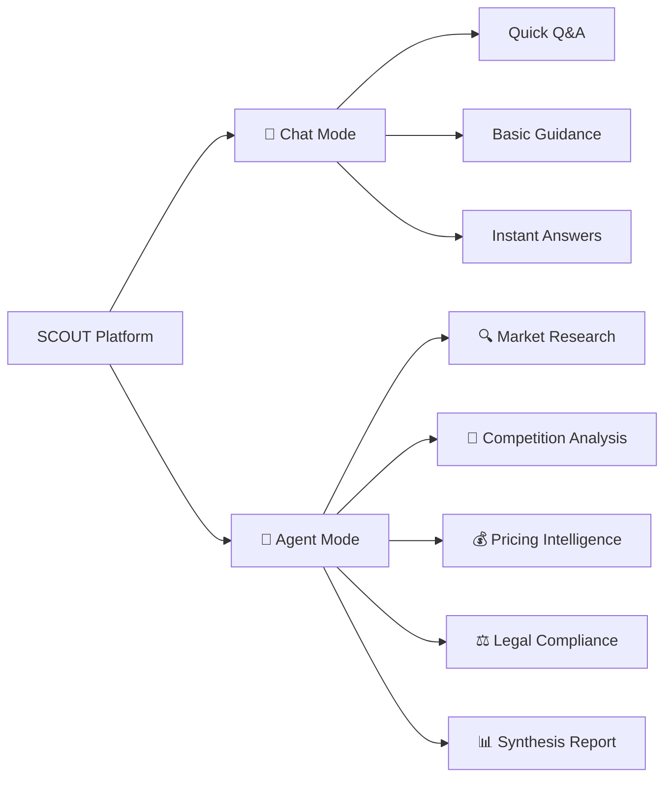
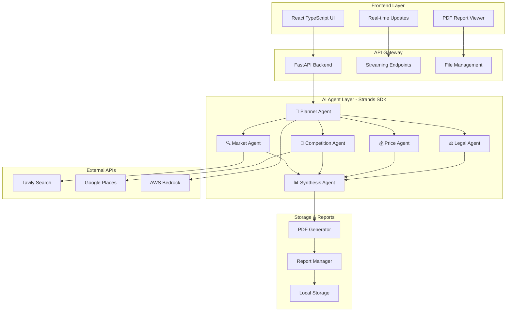
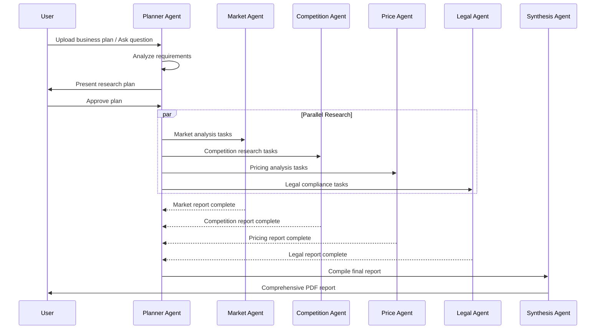

# 🔍 SCOUT - AI-Powered Market Intelligence Platform

<div align="center">

[](https://github.com/victorbash400/scout)
[](https://strandsagents.com)
[](https://agentcore.aws)

**🚀 Your AI-powered companion for smart market entry decisions**

*Empowering businesses and startups to venture into new markets with confidence*

[🎯 Live Demo](#-quick-start) • [📖 Documentation](#-how-it-works) • [🛠️ Setup](#-installation) • [🎥 Demo Video](#-demo)

</div>

---

## 🌟 What is SCOUT?

SCOUT is an intelligent market research platform that helps businesses and startups make informed decisions when entering new markets or launching new products. Built for the **AWS AI Agent Global Hackathon**, SCOUT leverages the power of **Strands SDK** and **AWS Bedrock** to provide comprehensive market intelligence through AI-powered research agents.

### 🎯 Core Mission
> **"Making sure your bases are covered before you leap"**

Whether you're a startup exploring a new market or an established business launching a new product, SCOUT ensures you have all the critical information needed to make confident GO/NO-GO decisions.

---

## ✨ Key Features

### 🤖 Dual Operation Modes



#### 💬 **Chat Mode**
- Instant answers to business questions
- Quick market insights
- Strategic guidance and recommendations
- Interactive Q&A experience

#### 🤖 **Agent Mode**
- Comprehensive multi-agent research pipeline
- Automated data collection and analysis
- Professional PDF reports generation
- Real-time progress tracking

### 🛠️ Powered by Advanced AI Tools

SCOUT integrates multiple specialized tools and APIs:

- **🔍 Tavily Search API** - Real-time web intelligence
- **🗺️ Google Places API** - Location-based competitor analysis  
- **🧠 AWS Bedrock** - Advanced AI reasoning and synthesis
- **📄 Enhanced PDF Generation** - Professional report formatting
- **⚡ Strands SDK** - Multi-agent orchestration

---

## 🏗️ Architecture Overview



### 🤖 Agent Workflow



---

## 🚀 Quick Start

### 📋 Prerequisites

- Python 3.8+
- Node.js 16+
- AWS Account (for Bedrock access)
- API Keys for Tavily and Google Places

### 🛠️ Installation

1. **Clone the repository**
```bash
git clone https://github.com/victorbash400/scout.git
cd scout
```

2. **Backend Setup**
```bash
cd scout-backend
pip install -r requirements.txt

# Configure environment variables
cp .env.example .env
# Edit .env with your API keys and AWS credentials
```

3. **Frontend Setup**
```bash
cd ../scout-frontend
npm install
npm run dev
```

4. **Start the Backend**
```bash
cd ../scout-backend
python main.py
```

### 🔑 Environment Configuration

Create a `.env` file in `scout-backend/`:

```env
# AWS Bedrock Configuration
AWS_ACCESS_KEY_ID=your_aws_access_key
AWS_SECRET_ACCESS_KEY=your_aws_secret_key
AWS_REGION=us-west-2
BEDROCK_MODEL_ID=anthropic.claude-3-5-sonnet-20241022-v2:0

# API Keys
TAVILY_API_KEY=your_tavily_api_key
GOOGLE_PLACES_API_KEY=your_google_places_api_key

# Storage Configuration
STORAGE_BACKEND=local
```

---

## 💡 How It Works

### 1. **Business Plan Analysis**
Upload your business plan or describe your venture. SCOUT's Planner Agent analyzes your requirements and creates a tailored research strategy.

### 2. **Multi-Agent Research Pipeline**

#### 🔍 **Market Agent**
- Analyzes market size and trends
- Identifies target demographics
- Assesses growth opportunities
- Provides market entry recommendations

#### 🏢 **Competition Agent**  
- Discovers direct competitors using Google Places API
- Analyzes competitive landscape
- Identifies market gaps and opportunities
- Maps competitor locations and strategies

#### 💰 **Price Agent**
- Researches pricing strategies in your market
- Analyzes competitor pricing models
- Provides pricing recommendations
- Identifies optimal price positioning

#### ⚖️ **Legal Agent**
- Researches regulatory requirements
- Identifies necessary licenses and permits
- Analyzes compliance obligations
- Provides legal risk assessment

### 3. **Intelligent Synthesis**
The Synthesis Agent combines all research findings into a comprehensive, actionable report with clear GO/NO-GO recommendations.

### 4. **Professional Reporting**
Generate beautifully formatted PDF reports with:
- Executive summaries
- Detailed analysis sections
- Data visualizations
- Actionable recommendations
- Source citations

---

## 🎮 Usage Examples

### 💬 Chat Mode Example
```
User: "What should I consider before opening a coffee shop in downtown Seattle?"

SCOUT: "Great question! Here are the key factors to consider:

1. **Market Saturation**: Seattle has a high density of coffee shops
2. **Local Preferences**: Strong preference for specialty/artisan coffee
3. **Foot Traffic**: Downtown areas have high morning/lunch rushes
4. **Competition**: Major players include Starbucks, local roasters
5. **Regulations**: Food service permits, health department requirements

Would you like me to run a comprehensive analysis using Agent Mode?"
```

### 🤖 Agent Mode Example
```
User: "Run a full market analysis for a specialty coffee shop in downtown Seattle"

SCOUT Agent Mode:
✅ Analyzing business requirements...
🔍 Market Agent: Researching Seattle coffee market trends
🏢 Competition Agent: Mapping nearby coffee shops  
💰 Price Agent: Analyzing local pricing strategies
⚖️ Legal Agent: Researching permits and regulations
📊 Synthesis Agent: Compiling comprehensive report

📄 Final Report: seattle_coffee_shop_analysis.pdf
```

---

## 🎯 Demo Features

For demonstration purposes, SCOUT is configured with optimized settings:

- **Limited API Calls**: Each agent makes only 1-2 API calls for cost efficiency
- **Streamlined Reports**: Focused on essential insights
- **Real-time Updates**: Live progress tracking via WebSocket streams
- **Quick Turnaround**: Complete analysis in under 5 minutes

### 🔧 Production Enhancements Available

SCOUT can be enhanced with additional tools for deeper research:

- **Social Media Analysis**: Sentiment analysis and trend monitoring
- **Financial Modeling**: Revenue projections and ROI calculations  
- **Supply Chain Analysis**: Vendor and logistics research
- **Customer Surveys**: Automated market research surveys
- **Regulatory Deep Dive**: Comprehensive legal compliance analysis

---

## 🛡️ Built for AWS AgentCore

SCOUT is designed for seamless deployment on **AWS AgentCore**, leveraging:

- **AWS Bedrock**: For advanced AI model access
- **Serverless Architecture**: Scalable and cost-effective
- **Managed Infrastructure**: Reduced operational overhead
- **Enterprise Security**: AWS-grade security and compliance

---

## 🎥 Demo

[🎬 Watch SCOUT in Action](https://github.com/victorbash400/scout)

See how SCOUT transforms a simple business idea into a comprehensive market intelligence report in minutes.

---

## 🤝 Contributing

We welcome contributions! This project was built for the AWS AI Agent Global Hackathon and showcases the power of multi-agent AI systems.

### 🔧 Development Setup

1. Fork the repository
2. Create a feature branch
3. Make your changes
4. Submit a pull request

### 📝 Areas for Enhancement

- Additional research agents (Financial, Social Media, etc.)
- Enhanced data visualization
- Multi-language support
- Advanced reporting templates
- Integration with more data sources

---

## 📄 License

This project is licensed under the MIT License - see the [LICENSE](LICENSE) file for details.

---

## 🏆 AWS AI Agent Global Hackathon

SCOUT was created for the **AWS AI Agent Global Hackathon** to demonstrate:

- **Multi-Agent Orchestration** using Strands SDK
- **AWS Bedrock Integration** for advanced AI capabilities
- **Real-world Business Applications** of AI agents
- **Scalable Architecture** suitable for production deployment

### 🎯 Hackathon Goals Achieved

✅ **Innovation**: Novel approach to market research automation  
✅ **Technical Excellence**: Robust multi-agent architecture  
✅ **Business Value**: Practical solution for real market challenges  
✅ **AWS Integration**: Deep integration with AWS services  
✅ **Scalability**: Built for enterprise deployment on AgentCore  

---

<div align="center">

**🚀 Ready to scout your next market opportunity?**

[Get Started](https://github.com/victorbash400/scout) • [View Demo](#-demo) • [Join the Discussion](https://github.com/victorbash400/scout/discussions)

---

*Built with ❤️ using [Strands SDK](https://strandsagents.com) and [AWS Bedrock](https://aws.amazon.com/bedrock/)*

</div>