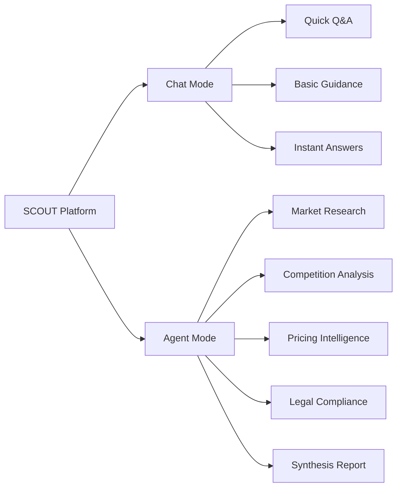
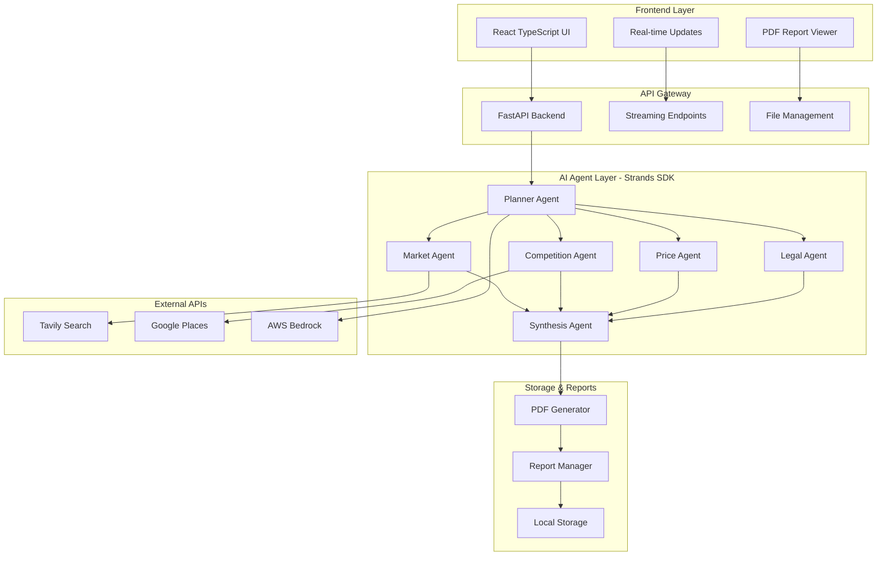
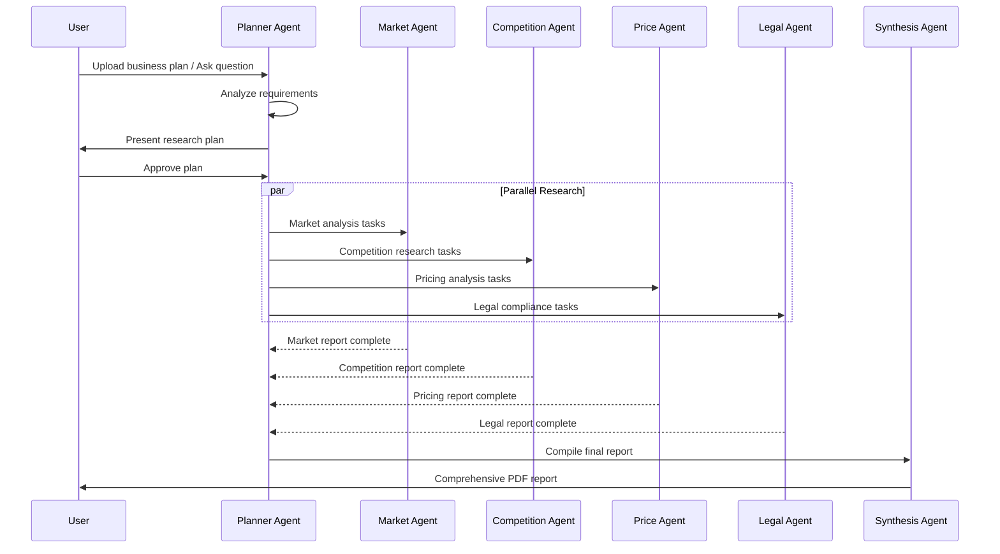

# SCOUT - AI-Powered Market Intelligence Platform

<div align="center">

[](https://strandsagents.com)
[](https://aws.amazon.com/apprunner/)

**Your AI-powered companion for smart market entry decisions**

*Empowering businesses and startups to venture into new markets with confidence*

[Documentation](#how-it-works) • [Setup](#installation) • [Live Demo](#deployment)

</div>

---

## What is SCOUT?

SCOUT is an intelligent market research platform that helps businesses and startups make informed decisions when entering new markets or launching new products. SCOUT leverages the power of **Strands SDK** and **AWS Bedrock** to provide comprehensive market intelligence through AI-powered research agents.

### Core Mission
> **"Making sure your bases are covered before you leap"**

Whether you're a startup exploring a new market or an established business launching a new product, SCOUT ensures you have all the critical information needed to make confident GO/NO-GO decisions.

---

## Key Features

### Dual Operation Modes



#### **Chat Mode**
- Instant answers to business questions
- Quick market insights
- Strategic guidance and recommendations
- Interactive Q&A experience

#### **Agent Mode**
- Comprehensive multi-agent research pipeline
- Automated data collection and analysis
- Professional PDF reports generation
- Real-time progress tracking

### Powered by Advanced AI Tools

SCOUT integrates multiple specialized tools and APIs:

- **Tavily Search API** - Real-time web intelligence
- **Google Places API** - Location-based competitor analysis  
- **AWS Bedrock** - Advanced AI reasoning and synthesis
- **Enhanced PDF Generation** - Professional report formatting
- **Strands SDK** - Multi-agent orchestration framework

---

## About Strands SDK

**Strands SDK** is a powerful framework for building multi-agent AI systems that enables sophisticated agent orchestration and coordination. SCOUT leverages Strands SDK to:

- **Agent Orchestration**: Coordinate multiple specialized AI agents working in parallel
- **Tool Integration**: Seamlessly integrate external APIs and services as agent tools
- **State Management**: Maintain conversation history and context across agent interactions
- **Streaming Responses**: Provide real-time updates and progress tracking
- **Error Handling**: Robust error recovery and fallback mechanisms
- **Model Flexibility**: Support for multiple AI models including AWS Bedrock, OpenAI, and others

Strands SDK abstracts the complexity of multi-agent systems, allowing developers to focus on business logic while the framework handles agent coordination, communication, and execution flow.

---

## Architecture Overview



### Agent Workflow



---

## Deployment

### Live Application

SCOUT is deployed and running on **AWS App Runner** with the following architecture:

- **Backend**: Python FastAPI application on AWS App Runner
- **Frontend**: React TypeScript application on Vercel
- **AI Models**: AWS Bedrock with Claude Sonnet
- **APIs**: Tavily Search and Google Places integration
- **Storage**: Local file system with S3 backup capability

### AWS App Runner Configuration

The application uses AWS App Runner for serverless container deployment with:

- **Auto-scaling**: Automatic scaling based on traffic
- **Managed Infrastructure**: No server management required  
- **Integrated Security**: AWS IAM and VPC integration
- **Environment Variables**: Secure secrets management via AWS Secrets Manager

---

## Local Development Setup

### Prerequisites

- Python 3.11+
- Node.js 18+
- AWS Account with Bedrock access
- API Keys for Tavily and Google Places

### Installation

1. **Clone the repository**
```bash
git clone https://github.com/victorbash400/scout.git
cd scout
```

2. **Backend Setup**
```bash
cd scout-backend
pip install -r requirements.txt
```

3. **Frontend Setup**
```bash
cd ../scout-frontend
npm install
```

### Environment Configuration

Create a `.env` file in `scout-backend/`:

```env
# AWS Configuration
AWS_ACCESS_KEY_ID=your_aws_access_key
AWS_SECRET_ACCESS_KEY=your_aws_secret_key
AWS_REGION=eu-north-1

# AWS Bedrock Model
BEDROCK_MODEL_ID=arn:aws:bedrock:eu-north-1:547688237843:inference-profile/eu.anthropic.claude-sonnet-4-20250514-v1:0

# External API Keys
TAVILY_API_KEY=your_tavily_api_key
GOOGLE_PLACES_API_KEY=your_google_places_api_key
PERPLEXITY_API_KEY=your_perplexity_api_key

# Application Settings
STORAGE_BACKEND=local
```

Create a `.env` file in `scout-frontend/`:

```env
VITE_API_BASE_URL=http://localhost:8000
```

### Running the Application

1. **Start the Backend**
```bash
cd scout-backend
python main.py
```

2. **Start the Frontend**
```bash
cd scout-frontend
npm run dev
```

The application will be available at:
- Frontend: http://localhost:5173
- Backend API: http://localhost:8000

### AWS App Runner Deployment

For production deployment on AWS App Runner:

1. **Configure `apprunner.yaml`**
```yaml
version: 1.0
runtime: python311
build:
  commands:
    build:
      - pip3 install -r requirements.txt 

run:
  runtime-version: 3.11
  command: python3 -m uvicorn main:app --host 0.0.0.0 --port 8080 
  
  network:
    port: 8080
    env: PORT
    
  env:
    - name: AWS_REGION
      value: "eu-north-1"
    - name: STORAGE_BACKEND
      value: "local"
  
  secrets:
    - name: AWS_ACCESS_KEY_ID
      value-from: "arn:aws:secretsmanager:eu-central-1:account:secret:Scout_access:AWS_ACCESS_KEY_ID::"
    - name: AWS_SECRET_ACCESS_KEY
      value-from: "arn:aws:secretsmanager:eu-central-1:account:secret:Scout_access:AWS_SECRET_ACCESS_KEY::"
    - name: TAVILY_API_KEY
      value-from: "arn:aws:secretsmanager:eu-central-1:account:secret:Scout_access:TAVILY_API_KEY::"
    - name: GOOGLE_PLACES_API_KEY
      value-from: "arn:aws:secretsmanager:eu-central-1:account:secret:Scout_access:GOOGLE_PLACES_API_KEY::"
    - name: PERPLEXITY_API_KEY
      value-from: "arn:aws:secretsmanager:eu-central-1:account:secret:Scout_access:PERPLEXITY_API_KEY::"
```

2. **Deploy via AWS Console or CLI**
```bash
aws apprunner create-service --cli-input-json file://apprunner-config.json
```

---

## How It Works

### 1. Business Plan Analysis
Upload your business plan or describe your venture. SCOUT's Planner Agent analyzes your requirements and creates a tailored research strategy.

### 2. Multi-Agent Research Pipeline

#### **Market Agent**
- Analyzes market size and trends using Tavily Search API
- Identifies target demographics and customer segments
- Assesses growth opportunities and market dynamics
- Provides market entry recommendations and timing

#### **Competition Agent**  
- Discovers direct competitors using Google Places API
- Analyzes competitive landscape and positioning
- Identifies market gaps and differentiation opportunities
- Maps competitor locations and strategic approaches

#### **Price Agent**
- Researches pricing strategies and models in your market
- Analyzes competitor pricing structures and positioning
- Provides pricing recommendations and optimization strategies
- Identifies optimal price points for market penetration

#### **Legal Agent**
- Researches regulatory requirements and compliance obligations
- Identifies necessary licenses, permits, and certifications
- Analyzes legal risks and potential barriers to entry
- Provides regulatory compliance roadmap

### 3. Intelligent Synthesis
The Synthesis Agent combines all research findings into a comprehensive, actionable report with clear GO/NO-GO recommendations based on market viability, competitive landscape, and risk assessment.

### 4. Professional Reporting
Generate beautifully formatted PDF reports with:
- Executive summaries with key findings
- Detailed analysis sections for each research area
- Actionable recommendations and next steps
- Source citations and data references

---

## Demo Features

For demonstration purposes, SCOUT is configured with optimized settings:

- **Limited API Calls**: Each agent makes only 1-2 API calls for cost efficiency
- **Streamlined Reports**: Focused on essential insights for quick evaluation
- **Real-time Updates**: Live progress tracking via Server-Sent Events
- **Quick Turnaround**: Complete analysis in under 5 minutes

### Advanced Capabilities

SCOUT agents include comprehensive analysis capabilities that can be enabled by adjusting system prompts:

- **Extended Research**: More thorough analysis with increased API calls
- **Document Processing**: Advanced PDF and document analysis capabilities
- **Multi-modal Research**: Combined text and data analysis
- **Extended API Integration**: Additional data sources and research tools
- **Custom Report Templates**: Industry-specific reporting formats

*Note: Advanced features require higher API usage and longer processing times.*

---

## Technical Architecture

SCOUT demonstrates advanced AI agent orchestration capabilities:

- **Multi-Agent Orchestration** using Strands SDK for coordinated research
- **AWS Bedrock Integration** for advanced AI reasoning and synthesis
- **Real-world Business Applications** solving actual market research challenges
- **Scalable Architecture** suitable for production deployment on AWS
- **Enterprise-Ready** with robust error handling and monitoring
- **API Integration** with external data sources for real-time intelligence

### Built for AWS Cloud

SCOUT leverages AWS services for enterprise-grade deployment:

- **AWS App Runner**: Serverless container deployment with auto-scaling
- **AWS Bedrock**: Advanced AI model access and inference
- **AWS Secrets Manager**: Secure API key and credential management
- **Serverless Architecture**: Cost-effective and scalable infrastructure
- **Enterprise Security**: AWS-grade security and compliance features

---

## Contributing

We welcome contributions! This project was built for the AWS AI Agent Global Hackathon and showcases the power of multi-agent AI systems.

### Development Setup

1. Fork the repository
2. Create a feature branch
3. Make your changes
4. Submit a pull request

### Areas for Enhancement

- Additional research agents (Financial Analysis, Social Media Intelligence, Risk Assessment)
- Enhanced data visualization and interactive charts
- Multi-language support for global market research
- Advanced reporting templates and customization options
- Integration with CRM and business planning tools
- Enterprise features like team collaboration and project management

---

## License

This project is licensed under the MIT License - see the [LICENSE](LICENSE) file for details.

---

<div align="center">

**Ready to scout your next market opportunity?**

[Get Started](https://github.com/victorbash400/scout) • [Live Demo](#deployment)

---

*Built using [Strands SDK](https://strandsagents.com), [AWS Bedrock](https://aws.amazon.com/bedrock/), and [AWS App Runner](https://aws.amazon.com/apprunner/)*

</div>