# 🔍 SCOUT - AI-Powered Market Intelligence Platform

<div align="center">


[](https://strandsagents.com)
[](https://agentcore.aws)

**🚀 Your AI-powered companion for smart market entry decisions**

*Empowering businesses and startups to venture into new markets with confidence*

[📖 Documentation](#-how-it-works) • [🛠️ Setup](#-installation)

</div>

---

## 🌟 What is SCOUT?

SCOUT is an intelligent market research platform that helps businesses and startups make informed decisions when entering new markets or launching new products. SCOUT leverages the power of **Strands SDK** and **AWS Bedrock** to provide comprehensive market intelligence through AI-powered research agents.

### 🎯 Core Mission
> **"Making sure your bases are covered before you leap"**

Whether you're a startup exploring a new market or an established business launching a new product, SCOUT ensures you have all the critical information needed to make confident GO/NO-GO decisions.

---

## ✨ Key Features

### 🤖 Dual Operation Modes

```mermaid
graph LR
    A[SCOUT Platform] --> B[💬 Chat Mode]
    A --> C[🤖 Agent Mode]
    
    B --> D[Quick Q&A]
    B --> E[Basic Guidance]
    B --> F[Instant Answers]
    
    C --> G[🔍 Market Research]
    C --> H[🏢 Competition Analysis]
    C --> I[💰 Pricing Intelligence]
    C --> J[⚖️ Legal Compliance]
    C --> K[📊 Synthesis Report]
```



#### 💬 **Chat Mode**
- Instant answers to business questions
- Quick market insights
- Strategic guidance and recommendations
- Interactive Q&A experience

#### 🤖 **Agent Mode**
- Comprehensive multi-agent research pipeline
- Automated data collection and analysis
- Professional PDF reports generation
- Real-time progress tracking

### 🛠️ Powered by Advanced AI Tools

SCOUT integrates multiple specialized tools and APIs:

- **🔍 Tavily Search API** - Real-time web intelligence
- **🗺️ Google Places API** - Location-based competitor analysis  
- **🧠 AWS Bedrock** - Advanced AI reasoning and synthesis
- **📄 Enhanced PDF Generation** - Professional report formatting
- **⚡ Strands SDK** - Multi-agent orchestration

---

## 🏗️ Architecture Overview

```mermaid
graph TB
    subgraph "Frontend Layer"
        A[React TypeScript UI]
        B[Real-time Updates]
        C[PDF Report Viewer]
    end
    
    subgraph "API Gateway"
        D[FastAPI Backend]
        E[Streaming Endpoints]
        F[File Management]
    end
    
    subgraph "AI Agent Layer - Strands SDK"
        G[🎯 Planner Agent]
        H[🔍 Market Agent]
        I[🏢 Competition Agent]
        J[💰 Price Agent]
        K[⚖️ Legal Agent]
        L[📊 Synthesis Agent]
    end
    
    subgraph "External APIs"
        M[Tavily Search]
        N[Google Places]
        O[AWS Bedrock]
    end
    
    subgraph "Storage & Reports"
        P[Local Storage]
        Q[PDF Generator]
        R[Report Manager]
    end
    
    A --> D
    B --> E
    C --> F
    D --> G
    G --> H
    G --> I
    G --> J
    G --> K
    H --> L
    I --> L
    J --> L
    K --> L
    H --> M
    I --> N
    G --> O
    L --> Q
    Q --> R
    R --> P
```



### 🤖 Agent Workflow


---

## 🚀 Quick Start

### 📋 Prerequisites

- Python 3.8+
- Node.js 16+
- AWS Account (for Bedrock access)
- API Keys for Tavily and Google Places

### 🛠️ Installation

1. **Clone the repository**
```bash
git clone https://github.com/victorbash400/scout.git
cd scout
```

2. **Backend Setup**
```bash
cd scout-backend
pip install -r requirements.txt

# Configure environment variables
cp .env.example .env
# Edit .env with your API keys and AWS credentials
```

3. **Frontend Setup**
```bash
cd ../scout-frontend
npm install
npm run dev
```

4. **Start the Backend**
```bash
cd ../scout-backend
python main.py
```

### 🔑 Environment Configuration

Create a `.env` file in `scout-backend/`:

```env
# AWS Bedrock Configuration
AWS_ACCESS_KEY_ID=your_aws_access_key
AWS_SECRET_ACCESS_KEY=your_aws_secret_key
AWS_REGION=us-west-2
BEDROCK_MODEL_ID=anthropic.claude-3-5-sonnet-20241022-v2:0

# API Keys
TAVILY_API_KEY=your_tavily_api_key
GOOGLE_PLACES_API_KEY=your_google_places_api_key

# Storage Configuration
STORAGE_BACKEND=local
```

---

## 💡 How It Works

### 1. **Business Plan Analysis**
Upload your business plan or describe your venture. SCOUT's Planner Agent analyzes your requirements and creates a tailored research strategy.

### 2. **Multi-Agent Research Pipeline**

#### 🔍 **Market Agent**
- Analyzes market size and trends
- Identifies target demographics
- Assesses growth opportunities
- Provides market entry recommendations

#### 🏢 **Competition Agent**  
- Discovers direct competitors using Google Places API
- Analyzes competitive landscape
- Identifies market gaps and opportunities
- Maps competitor locations and strategies

#### 💰 **Price Agent**
- Researches pricing strategies in your market
- Analyzes competitor pricing models
- Provides pricing recommendations
- Identifies optimal price positioning

#### ⚖️ **Legal Agent**
- Researches regulatory requirements
- Identifies necessary licenses and permits
- Analyzes compliance obligations
- Provides legal risk assessment

### 3. **Intelligent Synthesis**
The Synthesis Agent combines all research findings into a comprehensive, actionable report with clear GO/NO-GO recommendations.

### 4. **Professional Reporting**
Generate beautifully formatted PDF reports with:
- Executive summaries
- Detailed analysis sections
- Actionable recommendations
- Source citations

---


---

## 🎯 Demo Features

For demonstration purposes, SCOUT is configured with optimized settings:

- **Limited API Calls**: Each agent makes only 1-2 API calls for cost efficiency
- **Streamlined Reports**: Focused on essential insights
- **Real-time Updates**: Live progress tracking via WebSocket streams
- **Quick Turnaround**: Complete analysis in under 5 minutes

### 🔧 Advanced Capabilities

SCOUT agents include comprehensive analysis capabilities that can be enabled by adjusting system prompts:

- **Image Analysis**: Visual content processing and interpretation
- **Document Processing**: Advanced PDF and document analysis
- **Multi-modal Research**: Combined text, image, and data analysis
- **Extended API Integration**: Additional data sources and research tools
- **Deep Analysis Modes**: More thorough research with increased API calls

*Note: Advanced features require higher API usage and longer processing times.*

---

## 🛡️ Built for AWS AgentCore

SCOUT is designed for seamless deployment on **AWS AgentCore**, leveraging:

- **AWS Bedrock**: For advanced AI model access
- **Serverless Architecture**: Scalable and cost-effective
- **Managed Infrastructure**: Reduced operational overhead
- **Enterprise Security**: AWS-grade security and compliance

---


---

## 🤝 Contributing

We welcome contributions! This project was built for the AWS AI Agent Global Hackathon and showcases the power of multi-agent AI systems.

### 🔧 Development Setup

1. Fork the repository
2. Create a feature branch
3. Make your changes
4. Submit a pull request

### 📝 Areas for Enhancement

- Additional research agents (Financial, Social Media, etc.)
- Enhanced data visualization
- Multi-language support
- Advanced reporting templates
- Integration with more data sources

---

## 📄 License

This project is licensed under the MIT License - see the [LICENSE](LICENSE) file for details.

---

## 🏗️ Technical Excellence

SCOUT demonstrates advanced AI agent orchestration capabilities:

- **Multi-Agent Orchestration** using Strands SDK
- **AWS Bedrock Integration** for advanced AI capabilities
- **Real-world Business Applications** of AI agents
- **Scalable Architecture** suitable for production deployment
- **Enterprise-Ready** with robust error handling and monitoring  

---

<div align="center">

**🚀 Ready to scout your next market opportunity?**

[Get Started](https://github.com/victorbash400/scout)

---

*Built with ❤️ using [Strands SDK](https://strandsagents.com) and [AWS Bedrock](https://aws.amazon.com/bedrock/)*

</div>