# 🕵️ SCOUT - Strands Multi-Agent Intelligence System (Incremental A2A Architecture)

## 🎯 **SYSTEM OVERVIEW**

An advanced AI system leveraging the Strands SDK with the Agent-to-Agent (A2A) protocol for distributed multi-agent orchestration. SCOUT ingests business plans, orchestrates a team of specialized AI agents to conduct deep analysis, and delivers comprehensive GO/NO-GO decisions with actionable market intelligence reports.

**Current Status**: Planner Agent (Phase 1) is operational. System designed for incremental expansion to full 7-agent architecture.

-----

## 🧠 **MULTI-AGENT ARCHITECTURE**

**Core Philosophy:** Incremental hybrid approach combining direct function calls for the planner agent (currently working) with A2A protocol for distributed specialist agents (future phases). This enables seamless integration with the existing FastAPI application while providing distributed processing capabilities for research agents.

### **Phase-Based Agent Architecture**

```mermaid
graph TD
    A[📋 PLANNER AGENT<br/>✅ PHASE 1 - OPERATIONAL<br/>Direct Function Calls<br/>FastAPI Port: 8000] 
    B[🎛️ ORCHESTRATOR AGENT<br/>🔄 PHASE 2 - NEXT<br/>A2A Server Port: 8001]
    G[📊 SYNTHESIS AGENT<br/>🔄 PHASE 3 - FUTURE<br/>A2A Server Port: 8002]
    C[🥊 COMPETITION AGENT<br/>⏳ PHASE 4 - FUTURE<br/>A2A Server Port: 9001]
    D[👥 MARKET AGENT<br/>⏳ PHASE 4 - FUTURE<br/>A2A Server Port: 9002]
    E[💰 FINANCIAL AGENT<br/>⏳ PHASE 4 - FUTURE<br/>A2A Server Port: 9003]
    F[⚠️ RISK AGENT<br/>⏳ PHASE 4 - FUTURE<br/>A2A Server Port: 9004]
    
    A -.->|Future A2A Integration| B
    A -.->|Future A2A Integration| G
    B -.->|Future A2A Protocol| C
    B -.->|Future A2A Protocol| D
    B -.->|Future A2A Protocol| E
    B -.->|Future A2A Protocol| F
    
    style A fill:#4CAF50
    style B fill:#FFC107
    style G fill:#FFC107
    style C fill:#E0E0E0
    style D fill:#E0E0E0
    style E fill:#E0E0E0
    style F fill:#E0E0E0
```



**Implementation Phases:**
- **Phase 1 (Current)**: Planner Agent with direct function calls
- **Phase 2**: Add Orchestrator Agent with A2A server
- **Phase 3**: Add Synthesis Agent with A2A server
- **Phase 4**: Add Specialist Agents (Competition, Market, Financial, Risk)

-----

## 🏗️ **TECHNICAL ARCHITECTURE**

### **Current Technology Stack**

* **Amazon Bedrock**: Claude Sonnet 4 for all LLM operations
* **Strands SDK**: Core agent framework (currently used for Planner Agent)
* **FastAPI**: Current web framework for Planner Agent endpoints
* **Direct Function Calls**: Current integration pattern for Planner Agent

### **Future Technology Stack (Phases 2-4)**

* **Strands SDK with A2A**: Agent-to-Agent protocol support
* **Amazon Bedrock AgentCore**: Cloud tools (browser, code interpreter, memory)
* **Amazon S3**: Storage for business plans and intelligence reports
* **Amazon CloudWatch**: System monitoring and performance tracking
* **A2A Protocol**: HTTP-based agent communication standard

-----

## 🛠️ **CORRECT STRANDS AGENT & A2A CONFIGURATION**

> **⚠️ IMPORTANT**: Use these corrected imports and patterns based on [official Strands documentation](https://strandsagents.com/latest/documentation/docs/user-guide/concepts/multi-agent/agent-to-agent/)

### **Correct Installation**

```bash
# Core Strands SDK
pip install strands-agents

# A2A Protocol Support (for Phases 2-4)
pip install strands-agents-tools[a2a]
```

### **1. Planner Agent (Phase 1 - Current Implementation)**

**Status**: ✅ Operational with direct function calls
**Integration**: Direct function calls within FastAPI application
**Location**: `agents/planner_agent.py` (already working)

```python
# CURRENT IMPLEMENTATION - KEEP AS IS
import os
from typing import AsyncGenerator, List, Dict
from strands import Agent, tool
from config.settings import settings

# Future A2A integration (when ready for Phase 2+)
# from strands_tools.a2a_client import A2AClientToolProvider

@tool
def update_todo_list(category: str, tasks: List[str]) -> str:
    """Update research to-do list - current implementation works perfectly"""
    # Keep existing implementation
    pass

class PlannerAgent:
    def __init__(self, enable_a2a: bool = False):
        tools = [update_todo_list]
        
        # Phase 2+ Enhancement: Add A2A capabilities when ready
        if enable_a2a:
            a2a_provider = A2AClientToolProvider(known_agent_urls=[
                "http://localhost:8001",  # Orchestrator Agent
                "http://localhost:8002",  # Synthesis Agent
            ])
            tools.extend(a2a_provider.tools)

        self.agent = Agent(
            model=settings.bedrock_model_id,
            system_prompt="""Your current system prompt works perfectly - keep it""",
            tools=tools
        )

# Current functions - KEEP EXACTLY AS IS
def chat_with_planner(message: str) -> str:
    """Current implementation - working perfectly"""
    return planner.chat(message)

async def chat_with_planner_streaming(message: str) -> AsyncGenerator[str, None]:
    """Current implementation - working perfectly"""
    async for chunk in planner.chat_streaming(message):
        yield chunk
```

### **2. Orchestrator Agent (Phase 2 - Next Implementation)**

**Status**: 🔄 Ready for implementation
**Integration**: A2A Server (port 8001)
**Location**: `agents/orchestrator_agent.py` + `servers/orchestrator_server.py`

```python
# agents/orchestrator_agent.py
from strands import Agent
from strands.multiagent.a2a import A2AServer
from strands_tools.a2a_client import A2AClientToolProvider

orchestrator_agent = Agent(
    name="SCOUT Orchestrator",
    description="Research coordinator managing specialist agents",
    model="arn:aws:bedrock:eu-north-1:547688237843:inference-profile/eu.anthropic.claude-sonnet-4-20250514-v1:0",
    tools=[
        # A2A Client for specialist agents (Phase 4)
        A2AClientToolProvider(known_agent_urls=[
            "http://localhost:9001",  # Competition Agent
            "http://localhost:9002",  # Market Agent
            "http://localhost:9003",  # Financial Agent
            "http://localhost:9004",  # Risk Agent
        ]),
        # Add your research tools here: browser, code_interpreter, etc.
    ],
    system_prompt="""
    You are SCOUT's research orchestrator using A2A protocol.
    Your input is a detailed research brief from the Planner Agent.
    Deploy specialist agents via A2A protocol to complete research tasks.
    Coordinate their work and compile results into a complete intelligence package.
    """
)

# servers/orchestrator_server.py
orchestrator_server = A2AServer(
    agent=orchestrator_agent,
    host="0.0.0.0",
    port=8001,
    version="1.0.0"
)

# Start server
if __name__ == "__main__":
    orchestrator_server.serve()
```

### **3. Synthesis Agent (Phase 3 - Future Implementation)**

**Status**: ⏳ Future implementation
**Integration**: A2A Server (port 8002)
**Location**: `agents/synthesis_agent.py` + `servers/synthesis_server.py`

```python
# agents/synthesis_agent.py
from strands import Agent
from strands.multiagent.a2a import A2AServer

synthesis_agent = Agent(
    name="SCOUT Synthesis Agent",
    description="Report generation and synthesis specialist",
    model="arn:aws:bedrock:eu-north-1:547688237843:inference-profile/eu.anthropic.claude-sonnet-4-20250514-v1:0",
    tools=[
        # Add synthesis tools: code_interpreter, diagram, file_write
    ],
    system_prompt="""
    You are SCOUT's synthesis and reporting specialist.
    Transform raw research data into polished executive reports.
    Create: Executive Dashboard, comprehensive analysis report, strategic action plan.
    """
)

synthesis_server = A2AServer(
    agent=synthesis_agent,
    host="0.0.0.0",
    port=8002,
    version="1.0.0"
)
```

### **4. Specialist Agents (Phase 4 - Future Implementation)**

**Status**: ⏳ Future implementation
**Integration**: A2A Servers (ports 9001-9004)

```python
# Template for specialist agents
from strands import Agent
from strands.multiagent.a2a import A2AServer

def create_specialist_agent(name: str, description: str, system_prompt: str, port: int):
    agent = Agent(
        name=name,
        description=description,
        model="arn:aws:bedrock:eu-north-1:547688237843:inference-profile/eu.anthropic.claude-sonnet-4-20250514-v1:0",
        tools=[
            # Add specialist tools: browser, code_interpreter, file_write
        ],
        system_prompt=system_prompt
    )
    
    server = A2AServer(
        agent=agent,
        host="0.0.0.0",
        port=port,
        version="1.0.0"
    )
    
    return agent, server

# Competition Agent (Port 9001)
competition_agent, competition_server = create_specialist_agent(
    name="SCOUT Competition Analyst",
    description="Competitive intelligence specialist",
    system_prompt="You are SCOUT's competitive intelligence specialist...",
    port=9001
)

# Market Agent (Port 9002)  
market_agent, market_server = create_specialist_agent(
    name="SCOUT Market Analyst", 
    description="Market analysis specialist",
    system_prompt="You are SCOUT's market analysis specialist...",
    port=9002
)

# Financial Agent (Port 9003)
financial_agent, financial_server = create_specialist_agent(
    name="SCOUT Financial Analyst",
    description="Financial modeling specialist", 
    system_prompt="You are SCOUT's financial modeling specialist...",
    port=9003
)

# Risk Agent (Port 9004)
risk_agent, risk_server = create_specialist_agent(
    name="SCOUT Risk Analyst",
    description="Risk assessment specialist",
    system_prompt="You are SCOUT's risk assessment specialist...",
    port=9004
)
```

-----

## 🔄 **INCREMENTAL IMPLEMENTATION FLOW**

### **Phase 1: Current State (Working)**
1. **Planner Agent** receives business plans via FastAPI
2. **Planner Agent** creates structured to-do lists using `update_todo_list` tool
3. **Planner Agent** provides analysis and recommendations directly
4. **FastAPI endpoints** handle file uploads and streaming responses

### **Phase 2: Add Orchestrator (Next Step)**
1. Install A2A dependencies: `pip install strands-agents-tools[a2a]`
2. Create `agents/orchestrator_agent.py` and `servers/orchestrator_server.py`
3. Enable A2A in Planner Agent: `PlannerAgent(enable_a2a=True)`
4. Update Planner system prompt to include A2A coordination
5. Start Orchestrator server alongside FastAPI app

### **Phase 3: Add Synthesis (Future)**
1. Create `agents/synthesis_agent.py` and `servers/synthesis_server.py`
2. Update Planner A2A URLs to include Synthesis agent
3. Modify workflow: Planner → Orchestrator → Synthesis → User

### **Phase 4: Add Specialists (Future)**
1. Create all specialist agents (Competition, Market, Financial, Risk)
2. Update Orchestrator A2A URLs to include all specialists
3. Implement parallel research coordination
4. Full multi-agent intelligence pipeline operational

-----

## 📁 **PROJECT STRUCTURE (Incremental)**

```
scout/
├── SCOUT_BLUEPRINT.md                 # This document
├── scout-backend/
│   ├── agents/
│   │   ├── planner_agent.py          # ✅ Phase 1 - Current
│   │   ├── orchestrator_agent.py     # 🔄 Phase 2 - Next
│   │   ├── synthesis_agent.py        # ⏳ Phase 3 - Future
│   │   ├── competition_agent.py      # ⏳ Phase 4 - Future
│   │   ├── market_agent.py           # ⏳ Phase 4 - Future
│   │   ├── financial_agent.py        # ⏳ Phase 4 - Future
│   │   └── risk_agent.py             # ⏳ Phase 4 - Future
│   ├── servers/                      # 🔄 Phase 2+ - A2A Servers
│   │   ├── __init__.py
│   │   ├── orchestrator_server.py    # 🔄 Phase 2
│   │   ├── synthesis_server.py       # ⏳ Phase 3
│   │   ├── competition_server.py     # ⏳ Phase 4
│   │   ├── market_server.py          # ⏳ Phase 4
│   │   ├── financial_server.py       # ⏳ Phase 4
│   │   └── risk_server.py            # ⏳ Phase 4
│   ├── core/
│   │   ├── strands_client.py         # ✅ Current
│   │   ├── bedrock_client.py         # ✅ Current
│   │   └── agent_discovery.py        # 🔄 Phase 2 - A2A discovery
│   ├── utils/
│   │   ├── server_manager.py         # 🔄 Phase 2 - A2A lifecycle
│   │   └── health_checker.py         # 🔄 Phase 2 - A2A monitoring
│   ├── config/
│   │   ├── settings.py               # ✅ Current
│   │   └── a2a_config.py            # 🔄 Phase 2 - A2A ports
│   ├── main.py                       # ✅ Current FastAPI app
│   └── requirements.txt              # Update per phase
├── scripts/
│   ├── start_agents.py               # 🔄 Phase 2 - A2A startup
│   ├── stop_agents.py                # 🔄 Phase 2 - A2A shutdown
│   └── health_check.py               # 🔄 Phase 2 - A2A health
└── deployment/
    └── docker-compose.yml            # ⏳ Phase 4 - Multi-container
```

-----

## 🚀 **IMPLEMENTATION CHECKLIST**

### **Phase 1 Checklist (Current - Complete)**
- [x] Planner Agent with direct function calls
- [x] FastAPI integration working
- [x] Business plan upload functionality
- [x] Structured to-do list creation
- [x] Streaming responses
- [x] Mode-based behavior (CHAT/AGENT)

### **Phase 2 Checklist (Next)**
- [ ] Install: `pip install strands-agents-tools[a2a]`
- [ ] Create `agents/orchestrator_agent.py`
- [ ] Create `servers/orchestrator_server.py`
- [ ] Update `agents/planner_agent.py` to enable A2A
- [ ] Create `utils/server_manager.py` for A2A lifecycle
- [ ] Create `scripts/start_agents.py` for server startup
- [ ] Test Planner → Orchestrator A2A communication
- [ ] Update system prompts for coordination workflow

### **Phase 3 Checklist (Future)**
- [ ] Create `agents/synthesis_agent.py`
- [ ] Create `servers/synthesis_server.py` 
- [ ] Update Planner A2A URLs to include Synthesis
- [ ] Test full workflow: Planner → Orchestrator → Synthesis
- [ ] Implement report generation capabilities

### **Phase 4 Checklist (Future)**
- [ ] Create all specialist agent files
- [ ] Create all specialist server files
- [ ] Update Orchestrator A2A URLs to include specialists
- [ ] Implement parallel research coordination
- [ ] Create Docker composition for multi-container deployment
- [ ] Implement comprehensive monitoring and health checks

-----

## 📚 **REFERENCE DOCUMENTATION**

### **Official Strands SDK Resources**
- **A2A Protocol Documentation**: https://strandsagents.com/latest/documentation/docs/user-guide/concepts/multi-agent/agent-to-agent/
- **Strands SDK GitHub**: https://github.com/strands-agents/sdk-python
- **A2A Protocol Specification**: https://a2aproject.github.io/A2A/latest/
- **Strands Tools Documentation**: https://strandsagents.com/latest/documentation/docs/user-guide/tools/

### **Critical Implementation Notes**

1. **Correct Imports**:
   ```python
   # ✅ CORRECT
   from strands.multiagent.a2a import A2AServer
   from strands_tools.a2a_client import A2AClientToolProvider
   
   # ❌ WRONG - Don't use these
   # from strands.multiagent.a2a import A2AClientToolProvider
   ```

2. **Installation Commands**:
   ```bash
   # ✅ CORRECT
   pip install strands-agents-tools[a2a]
   
   # ❌ WRONG
   # pip install strands-agents[a2a]
   ```

3. **A2A Server Creation**:
   ```python
   # ✅ CORRECT
   server = A2AServer(agent=my_agent, host="0.0.0.0", port=9001)
   server.serve()  # For synchronous
   await server.serve_async()  # For asynchronous
   ```

4. **Natural Language Coordination**: A2AClientToolProvider automatically handles agent discovery and communication. No custom client code needed.

-----

## ⚡ **QUICK START FOR PHASE 2**

To move from Phase 1 to Phase 2 immediately:

1. **Install A2A support**:
   ```bash
   pip install strands-agents-tools[a2a]
   ```

2. **Create minimal orchestrator**:
   ```python
   # agents/orchestrator_agent.py
   from strands import Agent
   from strands.multiagent.a2a import A2AServer
   
   orchestrator_agent = Agent(
       name="SCOUT Orchestrator",
       description="Research coordinator",
       system_prompt="You coordinate research tasks from the Planner Agent."
   )
   
   orchestrator_server = A2AServer(agent=orchestrator_agent, port=8001)
   
   if __name__ == "__main__":
       orchestrator_server.serve()
   ```

3. **Enable A2A in Planner**:
   ```python
   # In agents/planner_agent.py
   planner = PlannerAgent(enable_a2a=True)
   ```

4. **Test integration**:
   ```bash
   # Terminal 1: Start orchestrator
   python agents/orchestrator_agent.py
   
   # Terminal 2: Start FastAPI (as usual)
   python main.py
   
   # Test: Send "[MODE: AGENT] Can you coordinate with the orchestrator agent?"
   ```

This blueprint provides the complete roadmap from your current working Phase 1 to the full multi-agent system, with proper Strands SDK implementation patterns and official documentation references.