# 🕵️ SCOUT - Strands Multi-Agent Intelligence System (7-Agent Model with A2A Protocol)

## 🎯 **SYSTEM OVERVIEW**

An advanced AI system leveraging the Strands SDK with the Agent-to-Agent (A2A) protocol for distributed multi-agent orchestration. SCOUT ingests business plans, orchestrates a team of 7 specialized AI agents across network services to conduct deep analysis, and delivers a comprehensive GO/NO-GO decision with actionable market intelligence reports.

-----

## 🧠 **MULTI-AGENT ARCHITECTURE**

**Core Philosophy:** The system uses a hybrid approach combining direct function calls for the planner agent (already working) with A2A protocol for distributed specialist agents. This enables seamless integration with the existing FastAPI application while providing distributed processing capabilities for research agents.

### **Hybrid Agent Architecture**

```mermaid
graph TD
    A[📋 PLANNER AGENT<br/>Direct Function Calls<br/>FastAPI Port: 8000] --> B[🎛️ ORCHESTRATOR AGENT<br/>A2A Server Port: 8001]
    A --> G[📊 SYNTHESIS AGENT<br/>A2A Server Port: 8002]
    B -.->|A2A Protocol| C[🥊 COMPETITION AGENT<br/>A2A Server Port: 9001]
    B -.->|A2A Protocol| D[👥 MARKET AGENT<br/>A2A Server Port: 9002]
    B -.->|A2A Protocol| E[💰 FINANCIAL AGENT<br/>A2A Server Port: 9003]
    B -.->|A2A Protocol| F[⚠️ RISK AGENT<br/>A2A Server Port: 9004]
    
    style A fill:#e1f5fe
    style B fill:#f3e5f5
    style G fill:#e8f5e8
    style C fill:#fff3e0
    style D fill:#fff3e0
    style E fill:#fff3e0
    style F fill:#fff3e0
```



**Hybrid Communication:**
- **Planner Agent**: Direct function calls within FastAPI app (port 8000)
- **Orchestrator & Synthesis**: A2A servers (ports 8001-8002)
- **Specialist Agents**: A2A servers (ports 9001-9004)
- **A2A Protocol**: HTTP-based agent-to-agent communication for distributed agents
- **Agent Discovery**: Via `/.well-known/agent.json` endpoints for A2A agents

-----

## 🏗️ **TECHNICAL ARCHITECTURE**

### **AWS Services Stack**

  * **Amazon Bedrock:** Claude Sonnet 4 (latest model) for all LLM operations.
  * **Strands SDK with A2A:** The core multi-agent orchestration framework with Agent-to-Agent protocol support.
  * **Amazon Bedrock AgentCore:** Provides essential cloud tools like an automated browser, code interpreter, and persistent memory.
  * **Amazon S3:** Secure storage for business plans and final intelligence reports.
  * **Amazon CloudWatch:** System monitoring, logging, and performance tracking.
  * **A2A Protocol:** HTTP-based agent communication standard for distributed multi-agent systems.

-----

## 🛠️ **STRANDS AGENT & A2A CONFIGURATION**

### **1. Planner Agent (Master Controller)**

The Planner initiates and concludes the analysis, acting as the main interface between the user's request and the distributed agent network. It runs as direct function calls within the FastAPI application.

```python
# PLANNER AGENT Configuration (Direct Function Calls)
from strands.multiagent.a2a import A2AClientToolProvider
import httpx
import asyncio

planner_agent = Agent(
    model="arn:aws:bedrock:eu-north-1:547688237843:inference-profile/eu.anthropic.claude-sonnet-4-20250514-v1:0",
    tools=[
        # A2A Client for Orchestrator and Synthesis agents
        A2AClientToolProvider(known_agent_urls=[
            "http://localhost:8001",  # Orchestrator Agent
            "http://localhost:8002",  # Synthesis Agent
        ]),
        
        # Foundational Tools
        file_read, # To process the initial business plan
        agent_core_memory, # To maintain context
        handoff_to_user # For clarifying questions
    ],
    system_prompt="""
    You are SCOUT's master controller using a hybrid approach. Your job is to:
    1. Receive a business plan and parse it.
    2. Create a structured, comprehensive research brief with specific to-do lists for the Competition, Market, Financial, and Risk agents.
    3. Call the 'orchestrator_agent' via A2A protocol with the research brief to begin the analysis.
    4. Once the Orchestrator returns the compiled data, call the 'synthesis_agent' via A2A protocol to generate the final report.
    5. Present the final report to the user.
    
    You run as direct function calls within the FastAPI application, not as an A2A server.
    """
)

# Direct function calls (as currently implemented)
def chat_with_planner(message: str) -> str:
    """Direct function call to planner agent (current implementation)"""
    return planner_agent(message)

async def chat_with_planner_streaming(message: str):
    """Streaming function call to planner agent (current implementation)"""
    async for event in planner_agent.stream_async(message):
        yield event
```

### **2. Orchestrator Agent (Research Coordinator)**

The Orchestrator manages the four specialist agents via A2A protocol, deploying them in parallel to execute the research brief.

```python
# ORCHESTRATOR AGENT Configuration
from strands.multiagent.a2a import A2AClientToolProvider
import asyncio

orchestrator_agent = Agent(
    model="arn:aws:bedrock:eu-north-1:547688237843:inference-profile/eu.anthropic.claude-sonnet-4-20250514-v1:0",
    tools=[
        # A2A Client for specialist agents
        A2AClientToolProvider(known_agent_urls=[
            "http://localhost:9001",  # Competition Agent
            "http://localhost:9002",  # Market Agent
            "http://localhost:9003",  # Financial Agent
            "http://localhost:9004",  # Risk Agent
        ]),
        
        # Research & Analysis Tools from AgentCore
        browser,
        code_interpreter,
        
        # Coordination Tools
        workflow,
        think,
        parallel_executor  # Custom tool for A2A parallel execution
    ],
    system_prompt="""
    You are SCOUT's research orchestrator using A2A protocol.
    Your input is a detailed research brief from the Planner Agent.
    Your job is to deploy the specialist agents (Competition, Market, Financial, Risk) via A2A protocol to complete their assigned tasks.
    Use the 'parallel_executor' tool to call all specialist agents simultaneously for maximum efficiency.
    Monitor their progress, collect all their output datasets, and return the complete, raw intelligence package.
    """
)
```

### **3. Specialist Research Agents (A2A Servers)**

These agents run as independent A2A servers, performing deep, focused intelligence gathering.

```python
# COMPETITION AGENT Configuration
from strands.multiagent.a2a import A2AServer

competition_agent = Agent(
    model="arn:aws:bedrock:eu-north-1:547688237843:inference-profile/eu.anthropic.claude-sonnet-4-20250514-v1:0",
    tools=[browser, code_interpreter, file_write],
    system_prompt="""
    You are SCOUT's competitive intelligence specialist.
    Your mission is to conduct deep competitor analysis based on the tasks you receive.
    Output a massive dataset including 50+ competitor profiles, pricing matrices, market positioning maps, and SWOT analyses.
    """
)

# Wrap as A2A Server
competition_server = A2AServer(
    agent=competition_agent,
    port=9001,
    host="0.0.0.0",
    version="1.0.0"
)

# MARKET AGENT Configuration
market_agent = Agent(
    model="arn:aws:bedrock:eu-north-1:547688237843:inference-profile/eu.anthropic.claude-sonnet-4-20250514-v1:0",
    tools=[browser, code_interpreter, file_write],
    system_prompt="""
    You are SCOUT's market analysis specialist.
    Your mission is to perform comprehensive market and customer analysis.
    Output extensive market intelligence including detailed demographics, complete TAM/SAM/SOM calculations, and 5-year growth projections.
    """
)

# Wrap as A2A Server
market_server = A2AServer(
    agent=market_agent,
    port=9002,
    host="0.0.0.0",
    version="1.0.0"
)

# FINANCIAL AGENT Configuration
financial_agent = Agent(
    model="arn:aws:bedrock:eu-north-1:547688237843:inference-profile/eu.anthropic.claude-sonnet-4-20250514-v1:0",
    tools=[code_interpreter, browser, file_write],
    system_prompt="""
    You are SCOUT's financial modeling specialist.
    Your mission is to analyze the business model's financial viability.
    Output comprehensive financial intelligence including detailed unit economics, cash flow projections, and funding requirement calculations.
    """
)

# Wrap as A2A Server
financial_server = A2AServer(
    agent=financial_agent,
    port=9003,
    host="0.0.0.0",
    version="1.0.0"
)

# RISK AGENT Configuration
risk_agent = Agent(
    model="arn:aws:bedrock:eu-north-1:547688237843:inference-profile/eu.anthropic.claude-sonnet-4-20250514-v1:0",
    tools=[browser, code_interpreter, file_write],
    system_prompt="""
    You are SCOUT's risk assessment specialist.
    Your mission is to identify and analyze all potential business threats.
    Output a complete risk intelligence report including regulatory requirements, market/operational risks, and competitive threat models.
    """
)

# Wrap as A2A Server
risk_server = A2AServer(
    agent=risk_agent,
    port=9004,
    host="0.0.0.0",
    version="1.0.0"
)
```

### **4. Synthesis Agent (Report Generator)**

The final agent in the chain, responsible for transforming raw data into a polished, human-readable report.

```python
# SYNTHESIS AGENT Configuration
from strands.multiagent.a2a import A2AServer

synthesis_agent = Agent(
    model="arn:aws:bedrock:eu-north-1:547688237843:inference-profile/eu.anthropic.claude-sonnet-4-20250514-v1:0",
    tools=[
        # Content Generation Tools
        code_interpreter, # For creating charts, graphs, and tables
        diagram,          # For visualizing concepts like positioning maps
        file_write        # To generate the final PDF/document
    ],
    system_prompt="""
    You are SCOUT's synthesis and reporting specialist.
    Your input is the raw, compiled data from all four research agents.
    Your job is to transform this massive dataset into a polished, executive-level intelligence report.
    You must create:
    1. An Executive Dashboard with a clear GO/NO-GO decision and confidence score.
    2. A comprehensive 150+ page report with detailed analysis, charts, graphs, and tables.
    3. A strategic 90-day action plan with specific milestones.
    """
)

# Wrap as A2A Server
synthesis_server = A2AServer(
    agent=synthesis_agent,
    port=8002,
    host="0.0.0.0",
    version="1.0.0"
)
```

-----

## 🔄 **HYBRID EXECUTION FLOW**

### **System Startup Phase**
1. **FastAPI Application Startup**
   * Start FastAPI app with Planner Agent (port 8000)
   * Launch A2A agent servers:
     - Orchestrator Agent (port 8001)
     - Synthesis Agent (port 8002)
     - Specialist Agents (ports 9001-9004)
   * Verify A2A agent discovery via `/.well-known/agent.json` endpoints

### **Analysis Execution Phase**

1.  **Phase 1: Plan Intake**

      * **USER** uploads a business plan via FastAPI endpoint.
      * **PLANNER AGENT** (direct function call) reads the document and generates a structured, multi-part research brief.

2.  **Phase 2: Intelligence Gathering**

      * **PLANNER AGENT** calls the `orchestrator_agent` via A2A protocol (port 8001), passing the research brief as input.
      * **ORCHESTRATOR AGENT** uses `parallel_executor` tool to deploy all specialist agents simultaneously via A2A protocol:
        - `competition_agent` (port 9001)
        - `market_agent` (port 9002) 
        - `financial_agent` (port 9003)
        - `risk_agent` (port 9004)
      * The four specialist agents execute their research autonomously using their tools (browser, code interpreter).
      * **ORCHESTRATOR AGENT** collects the massive output datasets from all four specialists via A2A responses and returns them as a single package.

3.  **Phase 3: Report Generation**

      * **PLANNER AGENT** receives the compiled raw data from the Orchestrator.
      * **PLANNER AGENT** calls the `synthesis_agent` via A2A protocol (port 8002), passing the complete data package as input.
      * **SYNTHESIS AGENT** processes all the data, generates charts, tables, and visuals, and assembles the final Executive Dashboard and Intelligence Report.

4.  **Phase 4: Delivery**

      * The final report is saved to Amazon S3 and presented to the user via FastAPI response.

### **Hybrid Communication Benefits**
- **Seamless Integration**: Planner agent works exactly as it does now
- **Distributed Processing**: Specialist agents run independently across different ports
- **Fault Tolerance**: If one specialist agent fails, others continue processing
- **Scalability**: Specialist agents can be deployed across different servers/containers
- **Monitoring**: Each A2A agent can be monitored independently via CloudWatch
- **Backward Compatibility**: Existing FastAPI endpoints continue to work unchanged

-----

## 📁 **HYBRID PROJECT STRUCTURE**

Updated file structure to support hybrid architecture with direct function calls for planner and A2A servers for other agents.

```
scout/
├── SCOUT_BLUEPRINT.md
├── scout-backend/
│   ├── agents/
│   │   ├── planner_agent.py
│   │   ├── orchestrator_agent.py
│   │   ├── competition_agent.py
│   │   ├── market_agent.py
│   │   ├── financial_agent.py
│   │   ├── risk_agent.py
│   │   └── synthesis_agent.py
│   ├── servers/
│   │   ├── __init__.py
│   │   ├── competition_server.py      # A2A server wrapper
│   │   ├── market_server.py          # A2A server wrapper
│   │   ├── financial_server.py       # A2A server wrapper
│   │   ├── risk_server.py           # A2A server wrapper
│   │   ├── synthesis_server.py      # A2A server wrapper
│   │   └── orchestrator_server.py   # A2A server wrapper
│   │   # Note: planner_server.py NOT needed - planner uses direct function calls
│   ├── core/
│   │   ├── strands_client.py
│   │   ├── bedrock_client.py
│   │   ├── agentcore_tools.py
│   │   ├── agent_memory.py
│   │   ├── a2a_client.py           # A2A client utilities
│   │   ├── agent_discovery.py      # Agent discovery logic
│   │   └── parallel_executor.py    # Custom parallel execution tool
│   ├── utils/
│   │   ├── server_manager.py       # Manage A2A server lifecycle
│   │   └── health_checker.py       # Monitor agent health
│   ├── config/
│   │   ├── a2a_config.py          # A2A server configurations
│   │   └── port_config.py         # Port assignments
│   ├── main.py                    # Main application entry point
│   ├── requirements.txt           # Updated with A2A dependencies
│   └── ... (rest of the backend structure)
├── scout-frontend/
│   ├── ... (frontend structure)
├── agentcore-config/
│   ├── ... (config files)
├── deployment/
│   ├── docker-compose.yml         # Multi-container A2A setup
│   ├── dockerfiles/
│   │   ├── competition.Dockerfile
│   │   ├── market.Dockerfile
│   │   ├── financial.Dockerfile
│   │   ├── risk.Dockerfile
│   │   └── core.Dockerfile
│   └── ... (deployment scripts)
└── scripts/
    ├── start_agents.py            # Start all A2A servers
    ├── stop_agents.py             # Stop all A2A servers
    └── health_check.py            # Check agent health
```

### **Key Hybrid Architecture Additions**
- **`servers/`**: A2A server wrapper files (excluding planner)
- **`core/a2a_client.py`**: A2A client utilities and communication
- **`core/agent_discovery.py`**: Dynamic agent discovery for A2A agents
- **`core/parallel_executor.py`**: Custom parallel execution for A2A
- **`utils/server_manager.py`**: Manage A2A server lifecycle
- **`config/a2a_config.py`**: A2A-specific configurations
- **`deployment/docker-compose.yml`**: Multi-container deployment for A2A agents
- **`main.py`**: FastAPI app with direct planner agent integration (existing)

-----

## 🚀 **HYBRID IMPLEMENTATION REQUIREMENTS**

### **Dependencies**
```bash
# Install Strands SDK with A2A support
pip install 'strands-agents[a2a]'

# Additional A2A dependencies
pip install httpx asyncio fastapi uvicorn
```

### **Port Configuration**
```python
# config/port_config.py
A2A_PORTS = {
    "planner": 8000,
    "orchestrator": 8001, 
    "synthesis": 8002,
    "competition": 9001,
    "market": 9002,
    "financial": 9003,
    "risk": 9004
}
```

### **A2A Server Startup Script**
```python
# scripts/start_agents.py
import asyncio
from concurrent.futures import ThreadPoolExecutor
from servers import *

async def start_all_agents():
    """Start all A2A servers in parallel (excluding planner)"""
    servers = [
        competition_server,
        market_server,
        financial_server,
        risk_server,
        synthesis_server,
        orchestrator_server
        # Note: planner_server NOT included - planner uses direct function calls
    ]
    
    with ThreadPoolExecutor(max_workers=6) as executor:
        futures = [executor.submit(server.serve) for server in servers]
        await asyncio.gather(*futures)

if __name__ == "__main__":
    asyncio.run(start_all_agents())
```

### **Agent Discovery Implementation**
```python
# core/agent_discovery.py
from strands.multiagent.a2a import A2ACardResolver
import httpx

async def discover_available_agents():
    """Discover all available A2A agents"""
    agent_urls = [
        "http://localhost:9001",  # Competition
        "http://localhost:9002",  # Market
        "http://localhost:9003",  # Financial
        "http://localhost:9004",  # Risk
    ]
    
    available_agents = []
    async with httpx.AsyncClient() as client:
        for url in agent_urls:
            try:
                resolver = A2ACardResolver(httpx_client=client, base_url=url)
                agent_card = await resolver.get_agent_card()
                available_agents.append({
                    "url": url,
                    "name": agent_card.name,
                    "description": agent_card.description,
                    "capabilities": agent_card.skills
                })
            except Exception as e:
                print(f"Agent at {url} not available: {e}")
    
    return available_agents
```

### **Parallel Execution Tool**
```python
# core/parallel_executor.py
import asyncio
from strands.multiagent.a2a import A2AClient, A2ACardResolver
import httpx

async def execute_parallel_research(research_brief):
    """Execute research tasks in parallel across A2A agents"""
    agent_urls = [
        "http://localhost:9001",  # Competition
        "http://localhost:9002",  # Market
        "http://localhost:9003",  # Financial
        "http://localhost:9004",  # Risk
    ]
    
    async def call_agent(url, task_data):
        async with httpx.AsyncClient() as client:
            resolver = A2ACardResolver(httpx_client=client, base_url=url)
            agent_card = await resolver.get_agent_card()
            a2a_client = A2AClient(httpx_client=client, agent_card=agent_card)
            
            # Send research task to agent
            response = await a2a_client.send_message(task_data)
            return response
    
    # Execute all agents in parallel
    tasks = [
        call_agent(url, research_brief.get_task_for_agent(url))
        for url in agent_urls
    ]
    
    results = await asyncio.gather(*tasks, return_exceptions=True)
    return compile_research_results(results)
```

### **Health Monitoring**
```python
# utils/health_checker.py
import httpx
import asyncio

async def check_agent_health(agent_url):
    """Check if an A2A agent is healthy"""
    try:
        async with httpx.AsyncClient() as client:
            response = await client.get(f"{agent_url}/.well-known/agent.json", timeout=5.0)
            return response.status_code == 200
    except:
        return False

async def monitor_all_agents():
    """Monitor health of all A2A agents (excluding planner)"""
    agent_urls = [
        "http://localhost:8001",  # Orchestrator
        "http://localhost:8002",  # Synthesis
        "http://localhost:9001",  # Competition
        "http://localhost:9002",  # Market
        "http://localhost:9003",  # Financial
        "http://localhost:9004",  # Risk
        # Note: Planner agent health checked via FastAPI /health endpoint
    ]
    
    health_status = {}
    for url in agent_urls:
        health_status[url] = await check_agent_health(url)
    
    return health_status
```

-----

## 🎯 **HYBRID ARCHITECTURE BENEFITS FOR SCOUT**

### **Scalability**
- **Horizontal Scaling**: Deploy agents across multiple servers
- **Load Distribution**: Balance workload across agent instances
- **Resource Optimization**: Scale individual agents based on demand

### **Fault Tolerance**
- **Independent Failures**: One agent failure doesn't crash the system
- **Graceful Degradation**: Continue processing with available agents
- **Automatic Recovery**: Restart failed agents without affecting others

### **Development & Testing**
- **Independent Development**: Develop and test A2A agents separately
- **Modular Deployment**: Deploy only the A2A agents you need
- **Easy Debugging**: Monitor and debug individual A2A agents
- **Backward Compatibility**: Existing planner agent continues to work unchanged

### **Production Benefits**
- **High Availability**: 99.9% uptime with proper orchestration
- **Cost Optimization**: Scale A2A agents based on actual usage
- **Monitoring**: Granular monitoring and alerting per A2A agent
- **Seamless Integration**: No changes needed to existing FastAPI endpoints
- **Gradual Migration**: Can implement A2A agents incrementally