# A2A Implementation Test Mode - Production Agents with Test Behavior

## Test Objective
Verify A2A protocol connectivity using the actual production agents in test mode. Each agent detects test mode and provides connectivity confirmation while being ready for full functionality later.

## Test Flow Architecture

```mermaid
graph TD
    A[📋 PLANNER AGENT<br/>Port: 8000<br/>Direct Function Call<br/>TEST MODE ENABLED] -->|"Regular task list + TEST MODE"| B[🎛️ ORCHESTRATOR AGENT<br/>Port: 8001<br/>A2A Server<br/>DETECTS TEST MODE]
    B -->|"Roll call in test mode"| C[🥊 COMPETITION AGENT<br/>Port: 9001<br/>A2A Server<br/>DETECTS TEST MODE]
    B -->|"Roll call in test mode"| D[👥 MARKET AGENT<br/>Port: 9002<br/>A2A Server<br/>DETECTS TEST MODE]
    B -->|"Roll call in test mode"| E[💰 FINANCIAL AGENT<br/>Port: 9003<br/>A2A Server<br/>DETECTS TEST MODE]
    B -->|"Roll call in test mode"| F[⚠️ RISK AGENT<br/>Port: 9004<br/>A2A Server<br/>DETECTS TEST MODE]
    C -->|"Present!"| B
    D -->|"Present!"| B
    E -->|"Present!"| B
    F -->|"Present!"| B
    B -->|"All agents ready"| A
    A -->|"Generate test report"| G[📊 SYNTHESIS AGENT<br/>Port: 8002<br/>A2A Server<br/>DETECTS TEST MODE]
    G -->|"Test report complete"| A
```



## Production Agent Files with Test Mode

### 1. Production Orchestrator Agent (`agents/orchestrator_agent.py`)

```python
from strands import Agent
from strands.multiagent.a2a import A2AServer
from strands_tools.a2a_client import A2AClientToolProvider

orchestrator_agent = Agent(
    name="SCOUT Orchestrator",
    description="Research coordinator managing specialist agents",
    model="arn:aws:bedrock:eu-north-1:547688237843:inference-profile/eu.anthropic.claude-sonnet-4-20250514-v1:0",
    tools=[
        A2AClientToolProvider(known_agent_urls=[
            "http://localhost:9001",  # Competition Agent
            "http://localhost:9002",  # Market Agent
            "http://localhost:9003",  # Financial Agent
            "http://localhost:9004",  # Risk Agent
        ])
        # Add production tools later: browser, code_interpreter, etc.
    ],
    system_prompt="""
    You are SCOUT's research orchestrator using A2A protocol.
    
    **TEST MODE DETECTION**: If the message contains "TEST MODE" or mentions testing connectivity:
    1. Respond: "ORCHESTRATOR: Received test request from Planner via A2A. Beginning roll call of specialist agents..."
    2. Contact each specialist agent with: "TEST MODE: Roll call - please confirm operational status"
    3. Collect responses and report: "ORCHESTRATOR: Roll call complete. [X/4] agents responding."
    4. If any agent fails: "ORCHESTRATOR: WARNING - [Agent Name] not responding"
    
    **PRODUCTION MODE**: When you receive actual research briefs:
    1. Deploy specialist agents with their specific tasks
    2. Coordinate parallel research execution
    3. Compile and return complete intelligence package
    
    Always detect the mode from the incoming message content.
    """
)

orchestrator_server = A2AServer(
    agent=orchestrator_agent,
    host="0.0.0.0",
    port=8001,
    version="1.0.0"
)

if __name__ == "__main__":
    print("Starting SCOUT Orchestrator Agent on port 8001...")
    orchestrator_server.serve()
```

### 2. Production Specialist Agents with Test Mode

```python
# agents/competition_agent.py
from strands import Agent
from strands.multiagent.a2a import A2AServer

competition_agent = Agent(
    name="SCOUT Competition Agent",
    description="Competitive intelligence specialist",
    model="arn:aws:bedrock:eu-north-1:547688237843:inference-profile/eu.anthropic.claude-sonnet-4-20250514-v1:0",
    tools=[
        # Production tools will be added here: browser, code_interpreter, file_write
    ],
    system_prompt="""
    You are SCOUT's competitive intelligence specialist.
    
    **TEST MODE DETECTION**: If message contains "TEST MODE":
    - Respond: "COMPETITION AGENT: Present! Received test message from orchestrator via A2A. Ready for competitive analysis when production tools are added."
    
    **PRODUCTION MODE**: When you receive actual competitive analysis tasks:
    - Conduct deep competitor analysis based on the tasks received
    - Output comprehensive competitor profiles, pricing matrices, positioning maps, SWOT analyses
    - Use all available research tools for intelligence gathering
    
    Detect mode from message content and respond accordingly.
    """
)

competition_server = A2AServer(
    agent=competition_agent,
    host="0.0.0.0",
    port=9001,
    version="1.0.0"
)

if __name__ == "__main__":
    print("Starting SCOUT Competition Agent on port 9001...")
    competition_server.serve()

# agents/market_agent.py
market_agent = Agent(
    name="SCOUT Market Agent",
    description="Market analysis specialist", 
    model="arn:aws:bedrock:eu-north-1:547688237843:inference-profile/eu.anthropic.claude-sonnet-4-20250514-v1:0",
    tools=[
        # Production tools: browser, code_interpreter, file_write
    ],
    system_prompt="""
    You are SCOUT's market analysis specialist.
    
    **TEST MODE DETECTION**: If message contains "TEST MODE":
    - Respond: "MARKET AGENT: Present! Received test message from orchestrator via A2A. Ready for market analysis when production tools are added."
    
    **PRODUCTION MODE**: When you receive actual market analysis tasks:
    - Perform comprehensive market and customer analysis
    - Output market intelligence including demographics, TAM/SAM/SOM calculations, growth projections
    - Execute detailed market sizing and validation studies
    """
)

market_server = A2AServer(agent=market_agent, host="0.0.0.0", port=9002, version="1.0.0")

# agents/financial_agent.py  
financial_agent = Agent(
    name="SCOUT Financial Agent",
    description="Financial modeling specialist",
    model="arn:aws:bedrock:eu-north-1:547688237843:inference-profile/eu.anthropic.claude-sonnet-4-20250514-v1:0",
    tools=[
        # Production tools: code_interpreter, browser, file_write
    ],
    system_prompt="""
    You are SCOUT's financial modeling specialist.
    
    **TEST MODE DETECTION**: If message contains "TEST MODE":
    - Respond: "FINANCIAL AGENT: Present! Received test message from orchestrator via A2A. Ready for financial analysis when production tools are added."
    
    **PRODUCTION MODE**: When you receive actual financial analysis tasks:
    - Analyze business model financial viability
    - Output unit economics, cash flow projections, funding requirements
    - Create comprehensive financial models and investment analysis
    """
)

financial_server = A2AServer(agent=financial_agent, host="0.0.0.0", port=9003, version="1.0.0")

# agents/risk_agent.py
risk_agent = Agent(
    name="SCOUT Risk Agent", 
    description="Risk assessment specialist",
    model="arn:aws:bedrock:eu-north-1:547688237843:inference-profile/eu.anthropic.claude-sonnet-4-20250514-v1:0",
    tools=[
        # Production tools: browser, code_interpreter, file_write
    ],
    system_prompt="""
    You are SCOUT's risk assessment specialist.
    
    **TEST MODE DETECTION**: If message contains "TEST MODE":
    - Respond: "RISK AGENT: Present! Received test message from orchestrator via A2A. Ready for risk analysis when production tools are added."
    
    **PRODUCTION MODE**: When you receive actual risk analysis tasks:
    - Identify and analyze all potential business threats
    - Output regulatory requirements, market/operational risks, competitive threat models
    - Provide comprehensive risk intelligence and mitigation strategies
    """
)

risk_server = A2AServer(agent=risk_agent, host="0.0.0.0", port=9004, version="1.0.0")
```

### 3. Production Synthesis Agent (`agents/synthesis_agent.py`)

```python
from strands import Agent
from strands.multiagent.a2a import A2AServer

synthesis_agent = Agent(
    name="SCOUT Synthesis Agent",
    description="Report generation and synthesis specialist",
    model="arn:aws:bedrock:eu-north-1:547688237843:inference-profile/eu.anthropic.claude-sonnet-4-20250514-v1:0",
    tools=[
        # Production tools: code_interpreter, diagram, file_write
    ],
    system_prompt="""
    You are SCOUT's synthesis and reporting specialist.
    
    **TEST MODE DETECTION**: If message contains "TEST MODE":
    - Respond: "SYNTHESIS AGENT: Present! Received synthesis test request from Planner via A2A. All systems ready for complete intelligence flow when production tools are added."
    
    **PRODUCTION MODE**: When you receive compiled research data:
    - Transform raw data into polished executive reports
    - Create Executive Dashboard with GO/NO-GO decision and confidence score
    - Generate comprehensive analysis report with charts, graphs, and tables
    - Provide strategic 90-day action plan with specific milestones
    """
)

synthesis_server = A2AServer(
    agent=synthesis_agent,
    host="0.0.0.0", 
    port=8002,
    version="1.0.0"
)

if __name__ == "__main__":
    print("Starting SCOUT Synthesis Agent on port 8002...")
    synthesis_server.serve()
```

### 4. Updated Production Planner Agent with Test Mode

```python
# Update your existing agents/planner_agent.py
class PlannerAgent:
    def __init__(self, enable_a2a: bool = False):
        # Your existing initialization code
        tools = [update_todo_list]
        
        if enable_a2a:
            a2a_provider = A2AClientToolProvider(known_agent_urls=[
                "http://localhost:8001",  # Orchestrator Agent
                "http://localhost:8002",  # Synthesis Agent
            ])
            tools.extend(a2a_provider.tools)

        # Enhanced system prompt with test mode
        system_prompt = """You are SCOUT, a business planning assistant. 
        You help users analyze business plans and create structured research to-do lists.
        
        You have three modes of operation:
        
        CHAT MODE:
        - Engage in general conversation about business planning
        - Answer questions and provide guidance
        - Do NOT create research plans or call tools
        
        AGENT MODE:
        1. Analyze the business plan and identify key areas for research
        2. Create a structured to-do list with specific tasks for different specialist agents
        3. Use the update_todo_list tool to add tasks to appropriate categories
        
        A2A_TEST MODE:
        1. Respond: "PLANNER: Starting A2A connectivity test..."
        2. Contact orchestrator_agent with: "TEST MODE: Perform roll call of all specialist agents"
        3. Wait for orchestrator response
        4. Contact synthesis_agent with: "TEST MODE: Confirm synthesis connectivity"
        5. Report results: "A2A TEST COMPLETE: [Success/Failure details]"
        
        PRODUCTION A2A MODE (when tools are added):
        1. Create research brief
        2. Contact orchestrator_agent with actual research tasks
        3. Contact synthesis_agent with compiled data
        4. Present final intelligence report
        
        The to-do list categories are:
        - competition_tasks, market_tasks, financial_tasks, risk_tasks, synthesis_requirements
        
        Always detect mode from the user's message prefix.
        """ + your_existing_system_prompt_continuation

        self.agent = Agent(
            model=settings.bedrock_model_id,
            system_prompt=system_prompt,
            tools=tools
        )
```

## Server Management Script

```python
# scripts/start_agents.py
import subprocess
import time
import sys

def start_agent(script_path, agent_name):
    print(f"Starting {agent_name}...")
    process = subprocess.Popen([sys.executable, script_path])
    time.sleep(2)
    return process

if __name__ == "__main__":
    processes = []
    
    # Start all production agents
    agents = [
        ("agents/orchestrator_agent.py", "Orchestrator"),
        ("agents/synthesis_agent.py", "Synthesis"), 
        ("agents/competition_agent.py", "Competition"),
        ("agents/market_agent.py", "Market"),
        ("agents/financial_agent.py", "Financial"),
        ("agents/risk_agent.py", "Risk")
    ]
    
    for script, name in agents:
        process = start_agent(script, name)
        processes.append(process)
    
    print("All SCOUT agents started! Press Ctrl+C to stop all agents.")
    
    try:
        while True:
            time.sleep(1)
    except KeyboardInterrupt:
        print("\nStopping all agents...")
        for process in processes:
            process.terminate()
```

## Test Execution

```bash
# Enable A2A in your planner
# In agents/planner_agent.py: planner = PlannerAgent(enable_a2a=True)

# Terminal 1: Start all agents
python scripts/start_agents.py

# Terminal 2: Start FastAPI
python main.py

# Terminal 3: Test connectivity
curl -X POST "http://localhost:8000/chat" \
  -H "Content-Type: application/json" \
  -d '{"message": "[MODE: A2A_TEST] Test connectivity"}'
```

This approach uses the actual production agents with intelligent test mode detection. When you're ready for production, you just send normal research tasks instead of test messages, and the agents automatically switch to full functionality mode.